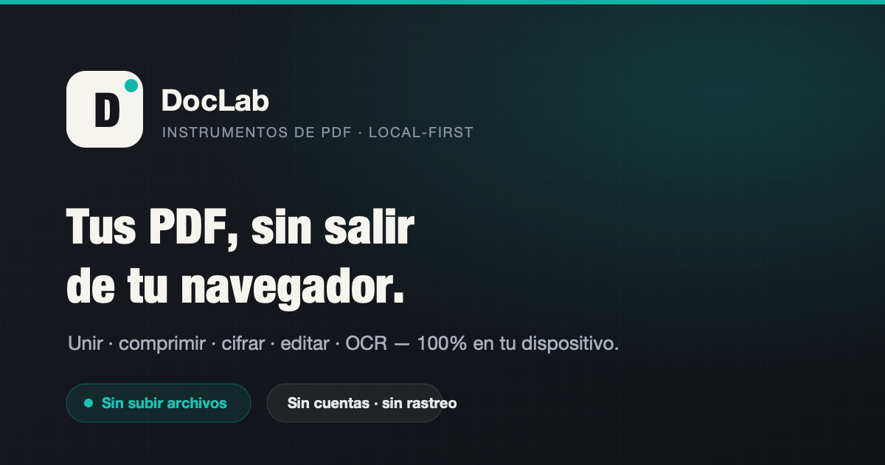

<div align="center">



# DocLab

**Herramientas de PDF que se procesan en tu navegador. Tus archivos nunca salen de tu dispositivo.**

[](LICENSE)


</div>

---

## ¿Qué es DocLab?

DocLab es una suite de herramientas de PDF —**un clon privacy-first de iLovePDF**— con una diferencia de fondo:
casi todo lo que otras webs hacen en sus servidores, DocLab lo hace **dentro de tu navegador** con WebAssembly.

Unir, dividir, comprimir, cifrar, editar, reconocer texto (OCR) o convertir: el documento se abre en memoria,
se procesa en tu equipo y se descarga. **No hay subida, no hay cuentas, no hay retención.** La privacidad no es
una promesa de la letra pequeña: es la arquitectura.

> 🔒 Puedes comprobarlo: abre la pestaña «Network» del navegador mientras procesas un archivo y verás que no se
> envía nada. Muchas herramientas funcionan incluso sin conexión.

## ✨ Funciones

- **Organizar** — unir, dividir, reordenar, rotar, N-up (varias páginas por hoja), numerar.
- **Optimizar** — comprimir (recompresión inteligente de imágenes), pasar imágenes ↔ PDF.
- **Editar** — editor visual, marcas de agua, formularios (crear, rellenar, firmar).
- **Seguridad** — proteger/desbloquear con contraseña (AES-256), censurar de verdad, sanear (quitar JS/adjuntos/metadatos), comparar versiones.
- **Convertir / IA** — OCR para hacer buscables los escaneados, PDF → Word, y un buscador con IA que sugiere la herramienta adecuada.

## 🛡️ Privacidad y seguridad

- **Procesamiento local por defecto** con WebAssembly (pdf-lib, pdf.js, qpdf, tesseract.js), todo **autoalojado** — sin CDNs de terceros.
- **La única función con red** es la búsqueda con IA, a la que solo viaja tu frase de búsqueda, **jamás un archivo**.
- **Content-Security-Policy estricta** (`'self'` + `'wasm-unsafe-eval'`), cabeceras de seguridad, cifrado en un Web Worker.
- **Sin dependencias vulnerables** (`npm audit` en verde), solo licencias permisivas (MIT/Apache/ISC), CI + Dependabot.
- Sin `dangerouslySetInnerHTML` en toda la app · TypeScript estricto · `oxlint` a cero avisos · 51 tests de lógica pura.

## 🧰 Tecnología

| Capa | Stack |
| --- | --- |
| Frontend | React 19 · TypeScript · Vite · Tailwind CSS v4 |
| Motores PDF | pdf-lib · pdf.js · qpdf-wasm (AES-256) · tesseract.js (OCR) · fflate · docx · pptxgenjs |
| Backend (mínimo) | Express · zod · helmet · rate-limit — **solo** el proxy de la búsqueda con IA |
| Infra | Docker · Nginx (CSP/HSTS) · despliegue tras túnel |

## 🤖 Un proyecto de demostración

DocLab es una **pieza de demostración desarrollada con asistencia de IA** (Claude), de principio a fin:
arquitectura, motores en WebAssembly, diseño, accesibilidad, tests, seguridad y documentación. Es un ejemplo
de hasta dónde puede llegar hoy el desarrollo asistido por IA manteniendo criterios reales de calidad,
privacidad y seguridad.

## 📂 Estructura

```
frontend/   SPA de React: herramientas, motores de PDF (lib/pdf), páginas y UI
backend/    API mínima en Express (solo el proxy de búsqueda con IA)
```

## 🚀 Desarrollo local

Requisitos: Node 22+. Cada parte es independiente:

```bash
# Frontend (la app y todas las herramientas)
cd frontend && npm install && npm run dev

# Backend (opcional: solo habilita la búsqueda con IA; requiere una clave de Gemini)
cd backend && npm install && npm run dev
```

Scripts útiles — Frontend: `npm run build` · `npm run lint` · `npm test`. Backend: `npm run typecheck` · `npm test`.

## 📄 Licencia

[MIT](LICENSE) © 2026. Código abierto. Las librerías de terceros conservan sus respectivas licencias.
